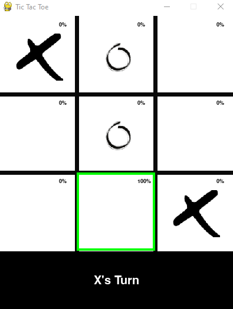

# Tic Tac Toe AI

This project serves as a learning tool for practicing and testing different game AI models. It provides a simple Tic Tac Toe game environment implemented with the Pygame library.

## Overview

The Tic Tac Toe AI project is designed as a starting point for testing different AI models and algorithms in a simple game environment. It features an AI opponent that uses the Minimax algorithm with Alpha-Beta pruning optimization for perfect gameplay, as well as different levels of random opponents for possible win scenarios. The project is open-source and can be used as a reference for building more complex AI models.

## Features

- Four difficulty levels: Easy, Medium, Hard and Impossible.
- Minimax algorithm with Alpha-Beta pruning for decision making.
- MLP classification model trained on all possible game states.
- Built with Pygame.

## How to Play

1. Clone the repository to your local machine.
2. Install the required dependencies with `pip install -r requirements.txt`.
3. Set the players and difficulty level in the [main.py](main.py) file.
4. Run `python main.py` to start the game.
